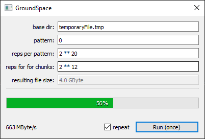

# GroundSpace

Tiny program to fill your harddrive with characters of your choice.  
Initially some terminal-script, but I got the idea to play a bit around with PyQt for a pretty ui.  
And yes, it is usable. Learnt a lot.  
Qt for C++ is nice, but PyQt is really easy and fast to develop. :thumbsup:

## Prerequisites aka Pip

$ pip install PyQt5

## How to use?
* run the script
* this is how the ui looks:  

* set parameters for pattern, repetitions and click "Run"
* watch the progressbar move to 100% :'D
* if the "repeat"-checkbox is checked, then the file-writing will be repeated (until unchecked or the disk is full)
* after each cycle the throughput (speed) will be updated in the bottom-left

## contact the author
mail@marcelpetrick.it

## planned ideas
* fix the bug that the run-button is not disabled after starting the process (multiple runs happens ..)
* maybe add an option to abort the writing
* add option to delete the file at shutdown of the app
