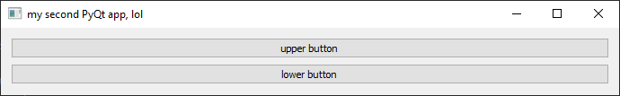

# My first Qt-Python-apps.
I have mediocre, self-taught Python-skills and some years of Qt-experience (C++), so why not throw both together
to create the BuildLogAnalyzer.
First iteration should create a single widget-app, which serves as drag&drop-target and which should just "grep" all
"warning:"-entries from a logfile (text).

Not sure if to use PySide or PyQt as binding. Better test both.

# second app

