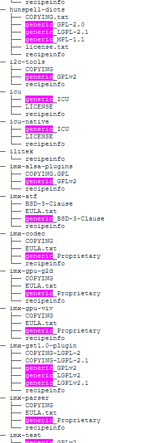

# challenge

Yocto-build with lots of used libraries & tools. Most of them OSS with different licenses.
to comply with law, prepare some license-files for later usage inside an app (running on the Yocto).
Given directory has for each lib a directory which contains several files.
Unformatted ASCII-text shall be enough for first iteration.

1. To prevent mixture: prepend the directory name (of the library) before the license-text-file name.
2. Copy the file to some "results" folder.
3. Looks like the license-files (sometimes up to six (eg. certain Qt components) are distinguishable by:
prefix "generic_".
   See:
   
4. use whatever language to automate this. JK, Python ;)
